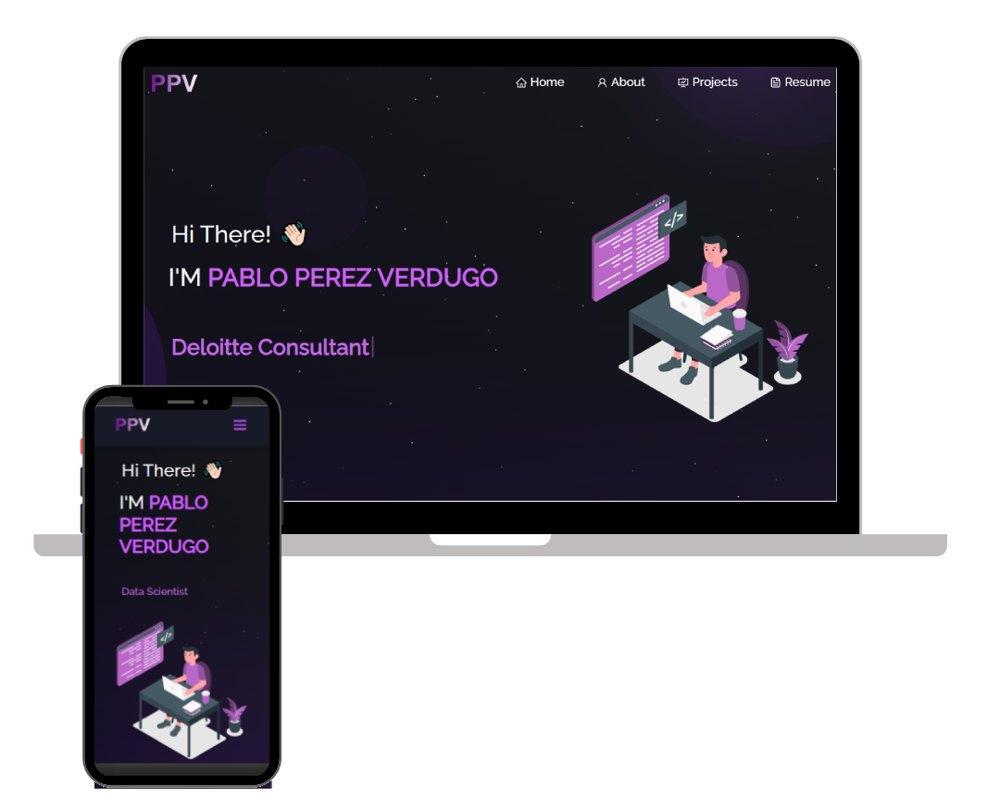

<h2 align="center">
  Portfolio Website 
  <a href="https://pabloperezverdugo.vercel.app/" target="_blank">pabloperezverdugo.com</a>
</h2>

  

 

## Built With

My personal portfolio <a href="https://pabloperezverdugo.vercel.app/" target="_blank">pabloperezverdugo.com</a> which features some of my GitHub projects as well as my resume and technical skills. 

This project was built using these technologies.

- React.js
- Node.js
- Express.js
- HTML
- CSS3
- VsCode
- Vercel
- Photopea

## Features

**📖 Multi-Page Layout**

**🎨 Styled with React-Bootstrap and Css with easy to customize colors**

**📱 Fully Responsive**

<h3 align="center">
    🔹
    <a href="https://github.com/pabloperezv/personal-website/issues">Report Bug</a>

</h3>
